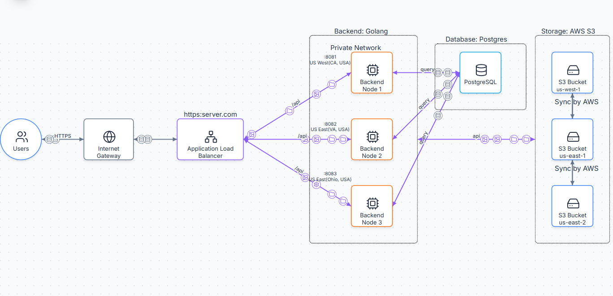

# Distributed Object Storage System

A simplified, educational implementation of a distributed object storage system built with Go, PostgreSQL, and AWS S3.

> **Note:** This is a learning project demonstrating distributed systems concepts. It is not production-ready and intentionally omits features like authentication, encryption, and advanced error handling for educational clarity.

## 🎯 Project Overview

This project implements a **stateless, horizontally-scalable object storage system** with the following architecture:

### Architecture Diagram



### Key Features
---
**Content-Addressable Storage** - Objects stored by SHA256 hash for automatic deduplication
**Horizontal Scalability** - Add unlimited backend nodes without coordination
**Stateless Architecture** - Backends can restart/die without data loss
**RESTful API** - Standard HTTP methods (PUT, GET, DELETE, HEAD)
**Shared Storage** - All nodes access same PostgreSQL and S3
**No Sync Required** - Unlike distributed databases, shared storage eliminates sync complexity

---

## Architecture

### Design Decisions

**1. Stateless Backends**
- All nodes are identical and interchangeable
- No local storage - everything in PostgreSQL/S3
- Easy to scale horizontally

**2. Shared PostgreSQL (Metadata)**
- Single source of truth for object metadata
- Handles: bucket, key, hash, size, timestamps
- Indexed for fast lookups

**3. AWS S3 (Object Storage)**
- Actual file bytes stored in S3
- Content-addressable: files stored by SHA256 hash
- Automatic deduplication (same file = same hash = one S3 object)

**4. Content-Addressable Hashing**
```
File "hello.txt" → SHA256 hash → 9a61081e586fae...
Stored in S3 as: objects/9a/61/9a61081e586fae...
```

### Why This Architecture?

| Aspect | Decision | Reason |
|--------|----------|--------|
| **Storage** | S3 instead of local disk | Avoid complex file replication logic |
| **Database** | Shared PostgreSQL | Eliminate metadata sync between nodes |
| **Hashing** | SHA256 content-addressable | Automatic deduplication, data integrity |
| **Stateless** | No local state | Easy scaling, fault tolerance |

---

## 📁 Project Structure

```
objectstore/
├── cmd/
│   └── server/
│       └── main.go              # Application entry point, HTTP handlers
├── internal/
│   ├── db/
│   │   └── db.go                # PostgreSQL connection & management
│   └── storage/
│       └── storage.go           # S3 operations & metadata CRUD
├── .env.example                 # Environment variables template
├── .gitignore
├── go.mod
├── go.sum
└── README.md
```

---

## 🚀 Setup & Installation

### Prerequisites

- Go 1.22+
- PostgreSQL (or Railway account)
- AWS Account with S3 access
- AWS CLI configured (optional)

### 1. Clone Repository

```bash
git clone https://github.com/HuyTanVan/objectstore.git
cd objectstore
```

### 2. Install Dependencies

```bash
go mod download
```

### 3. Setup AWS S3

**Create S3 Bucket:**
```bash
aws s3 mb s3://your-bucket-name --region us-east-1
```

**Create IAM User with S3 Access:**
1. AWS Console → IAM → Users → Create User
2. Attach policy: `AmazonS3FullAccess`
3. Create access key → Save credentials

### 4. Setup PostgreSQL

**Option A: Railway (Recommended)**
- Create Railway project
- Add PostgreSQL service
- Copy `DATABASE_URL`

**Option B: Local PostgreSQL**

### 5. Configure Environment Variables

```bash
cp .env.example .env
```

Edit `.env`:
```env
NODE_ID=node-1
PORT=8080

AWS_ACCESS_KEY_ID=<your-access-key-id>
AWS_SECRET_ACCESS_KEY=<your-secret-access-key>
AWS_REGION=<your-bucket-region>
S3_BUCKET_NAME=<your-bucket-name>

# Navigate Postgres Instance -> Variables -> Copy URL
# Use DATABASE_PUBLIC_URL if backend runs locally.
# Use DATABASE_URL if backend is deployed on Railway.
DATABASE_URL=<your-postgres-url-from-railway>
```

### 6. Run

```bash
go run cmd/server/main.go
```

Server starts on `http://localhost:8080`

---

## 📡 API Endpoints

### Upload Object
```bash
curl -X PUT http://localhost:8080/buckets/test/objects/hello.txt \
  --data "Hello World"
```

Response:
```json
{
  "message": "Upload successful",
  "path": "/buckets/test/objects/hello.txt",
  "etag": "a591a6d40bf420404a011733cfb7b190d62c65bf0bcda32b57b277d9ad9f146e",
  "storage": "s3"
}
```

### Download Object
```bash
curl http://localhost:8080/buckets/test/objects/hello.txt
```

### List Objects
```bash
curl http://localhost:8080/objects

# Filter by bucket
curl http://localhost:8080/objects?bucket=test
```

### Get Object Metadata
```bash
curl -I http://localhost:8080/buckets/test/objects/hello.txt
```

### Delete Object
```bash
curl -X DELETE http://localhost:8080/buckets/test/objects/hello.txt
```

---

## 🌐 Deployment to Railway

### Architecture on Railway

```
Railway Project
├── Backend Node 1
├── Backend Node 2
├── Backend Node 3
├── Load Balancer (optional)
└── PostgreSQL
```

### Steps

1. **Push to GitHub**
```bash
git add .
git commit -m "Initial commit"
git push
```

2. **Create Railway Project**
- New Project → Deploy from GitHub
- Select your repository

3. **Add PostgreSQL**
- Add Service → Database → PostgreSQL
- Railway automatically sets `DATABASE_URL`

4. **Deploy Backend Nodes (3 times)**

**Service 1:**
```
Environment Variables:
NODE_ID=node-1
AWS_ACCESS_KEY_ID=your_key
AWS_SECRET_ACCESS_KEY=your_secret
AWS_REGION=us-east-1
S3_BUCKET_NAME=your-bucket
```

**Service 2 & 3:** Same code, different `NODE_ID`

5. **Each service gets unique URL:**
- `https://node-1.up.railway.app`
- `https://node-2.up.railway.app`
- `https://node-3.up.railway.app`

6. **Point UI/Load Balancer to all 3 URLs**

---

## 🔍 How It Works

### Upload Flow

1. **Client uploads file to Backend Node 1**
2. **Backend computes SHA256 hash** of content
3. **Backend uploads to S3** at path: `objects/{hash[:2]}/{hash[2:4]}/{hash}`
4. **Backend saves metadata to PostgreSQL**:
   - bucket, key, hash, size, timestamp, node_id
5. **Done!** All other backends can now access it

### Download Flow

1. **Client requests file from Backend Node 2**
2. **Backend queries PostgreSQL** for hash
3. **Backend downloads from S3** using hash
4. **Backend streams to client**

### Why This Works

- **No file sync needed** - All nodes read from same S3
- **No metadata sync needed** - All nodes read from same PostgreSQL
- **Instant consistency** - Upload to Node 1, immediately visible on Node 2
- **Deduplication** - Same content = same hash = one S3 object

---

## What This Project Demonstrates

### Distributed Systems Concepts

✅ **Horizontal Scaling** - Add nodes without coordination
✅ **Stateless Architecture** - Nodes can restart without data loss
✅ **Content-Addressable Storage** - Files stored by hash
✅ **Load Balancing** - Distribute requests across nodes
✅ **Shared Storage Pattern** - Centralized state with distributed compute

### Why NOT Pure Distributed Databases?

This project intentionally uses **shared storage** (PostgreSQL + S3) instead of distributed databases (like Cassandra) to:
- Focus on stateless backend patterns
- Avoid complex consensus algorithms (Raft, Paxos)
- Eliminate sync complexity
- Show real-world cloud architecture

Many production systems (Dropbox, GitHub, etc.) use similar patterns!

---

## Current Limitations

### What's Missing (Intentionally) + Improvements

I built this project for learning purpose, not production-ready. Missing features + Improvements:

#### Security
- No authentication → Add JWT authentication
- No authorization → Add bucket-level permissions
- No encryption → Enable S3 server-side encryption / HTTPS/TLS
- No API keys → Implement API key system

#### Reliability
- No retry logic → Implement retry with exponential backoff
- No circuit breakers → Add circuit breakers (go-resilience)
- Limited error handling → Comprehensive error handling
- No health checks → Health check endpoint for load balancer

#### Features
- No versioning → Object versioning
- No multipart uploads → Multipart upload support
- No range requests → Range requests (partial downloads)
- No compression → Compression support
- No metadata search → Pre-signed URLs / Bucket lifecycle policies (optional)

#### Observability
- No metrics → Prometheus metrics
- Basic logging → Structured logging (zap/zerolog)
- No tracing → OpenTelemetry tracing
- No alerting → PagerDuty alerts / monitoring

#### Performance
- No caching → Redis/In-mem caching layers
- No CDN → CloudFront CDN integration
- No connection pooling → Database connection pooling
- No async processing → Add queue/background worker to allow async upload/delete processing

---

## Contributing

This is an educational project. Feel free to:
- Fork and experiment
- Add features from "Future Improvements"
- Share learnings
- Report issues

**Not accepting PRs** - This is a learning reference, not a maintained library.

---

## License

MIT License - Use for learning, not production!

---

### Technologies Used
- [Go](https://golang.org/) - Backend language
- [PostgreSQL](https://www.postgresql.org/) - Metadata database
- [AWS S3](https://aws.amazon.com/s3/) - Object storage
- [Railway](https://railway.app/) - Deployment platform


## ⭐ If You Found This Helpful

- Star the repository
- Share with others learning distributed systems
---

**Built with ❤️ for learning distributed systems and system design**


